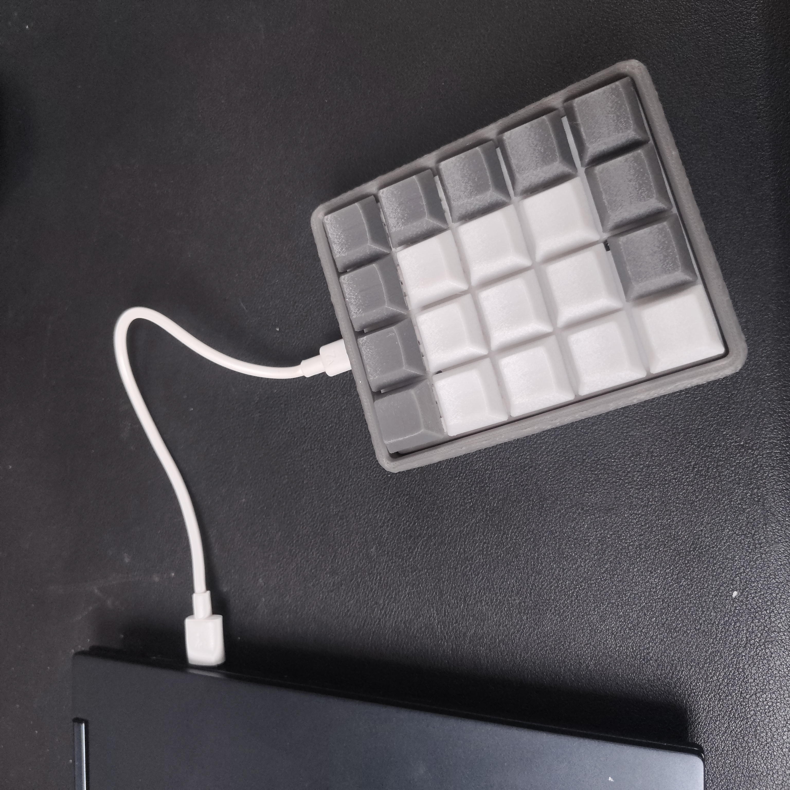
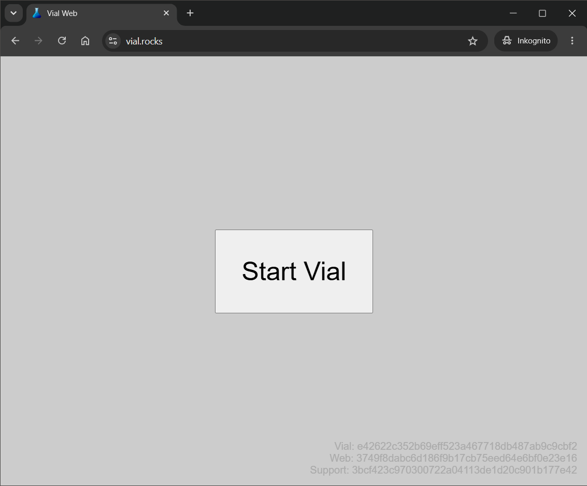
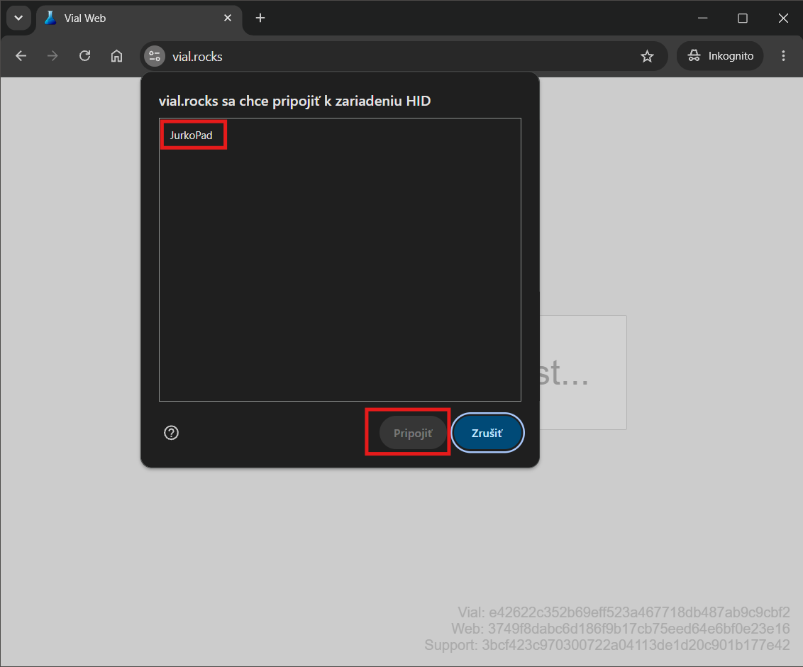
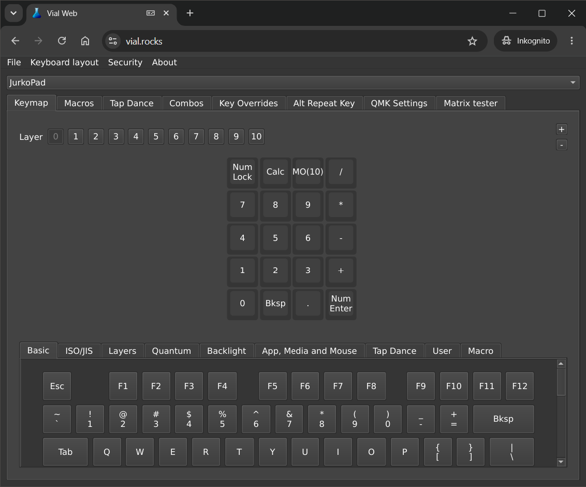
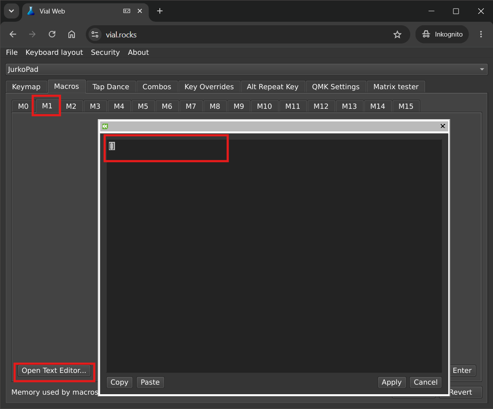
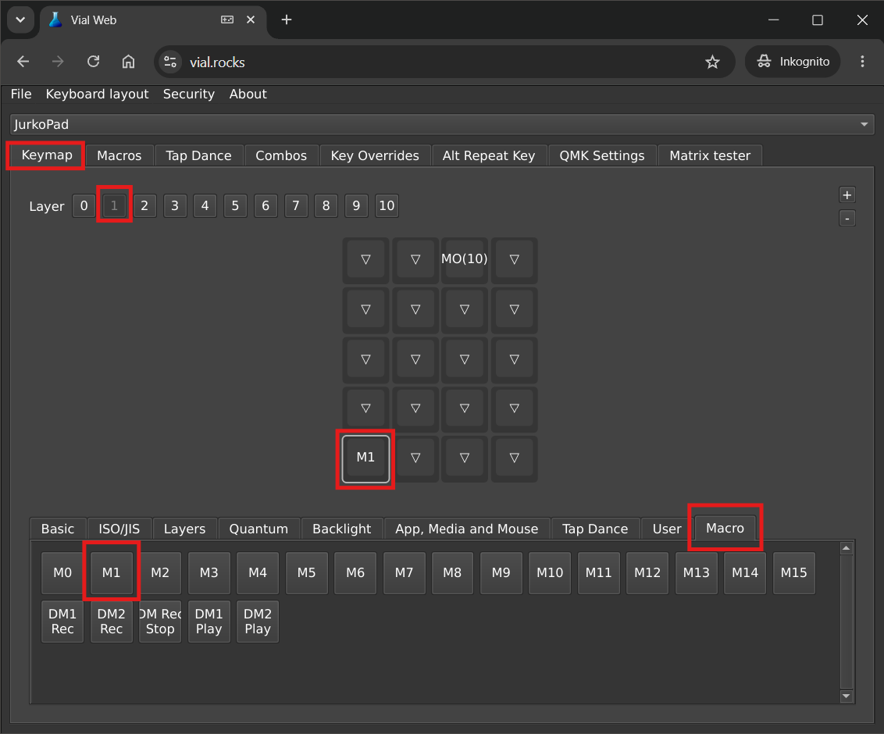

# JurkoPad 🔢⌨️

Ahoj Jurko!
Toto je tvoja vlastná klávesnica s číslami. Volá sa **JurkoPad**. Táto stránka ti ukáže, ako ju zapojiť, používať a ako si ju sám naprogramovať.
Klávesnica je s čistými, neoznačenými klávesami, avšak dostal si k nej maličký návod, ktorý ti povie, že kde sa čo nachádza. Taktiež si dostal malý skrutkovač, ktorým vieš klávesnicu rozobrať a pozrieť sa čo je vo vnútri. Neboj sa, ak by sa niečo pokazilo, popros o pomoc ocka, alebo strýka Mateja.

## 1. Ako ju zapojiť

1. Zober USB kábel.
2. Zapoj ho do JurkoPadu.
3. Druhý koniec zapoj do počítača.
4. Hotovo! Čísla sú hneď pripravené na použitie.



## 2. Ako ju používať

Skús stlačiť klávesu **7**. Mala by sa objaviť sedmička. Ak sa nič nestalo, čítaj ďalej - vysvetlím prečo.

Klávesnica má 20 tlačidiel:

```
🔢 Num Lock  🧮 Kalkulačka   🔧 Fn      ➗
7            8               9          ✖️
4            5               6          ➖
1            2               3          ➕
0            ,               .          ⏎ Enter
```

Prvé tlačidlo sa volá **Num Lock**. Je to taký vypínač pre čísla:

- Keď je **Num Lock zapnutý**, tlačidlá 0 až 9 píšu **čísla**.
- Keď je **Num Lock vypnutý**, tie isté tlačidlá robia iné veci (napríklad sa zmenia na šípky).

Keď JurkoPad zapojíš, sám sa pokúsi Num Lock zapnúť. Niekedy sa to ale nepodarí - závisí to od počítača. Ak čísla nefungujú, jednoducho stlač tlačidlo **Num Lock** a skús to znova.

## 3. Čarovné tlačidlo Fn a iné svety

Vnútri JurkoPadu je schovaných **10 svetov** (po anglicky sa volajú **Layer**, čítaj "lejer"). Ty si teraz vo **svete 0**, kde sú čísla.

Tlačidlo **Fn** ťa vie preniesť do iného sveta:

1. Podrž prst na **Fn**.
2. Popri tom stlač napríklad **1**.
3. Pusti obe tlačidlá.
4. Teraz si vo **svete 1**!

Skús teraz stlačiť čísla - budú fungovať úplne rovnako ako predtým. To je normálne! Svety 1 až 9 sú na začiatku úplne prázdne a prázdny svet sa správa presne ako svet 0. Až keď mu sám niečo naučíš (o chvíľu ti ukážem ako), bude v ňom niečo iné.

Chceš sa vrátiť k číslam? Podrž **Fn** a stlač **0**.

> 💡 Zapamätaj si: **Fn + číslo** (0 až 9) ťa prenesie do sveta s tým číslom. Toto vieš urobiť kedykoľvek, aj bez počítača.

## 4. Ako otvoriť Vial (program na počítači)

**Vial** je program v prehliadači, ktorým naučíš JurkoPad nové tlačidlá. Bude po anglicky, ale neboj sa - všetko ti tu vysvetlím.

1. Zapoj JurkoPad do počítača.
2. Otvor prehliadač **Chrome** a choď na stránku **vial.rocks**
3. Klikni na sivé tlačidlo **Start Vial**.

   

4. Objaví sa malé okienko. Pýta sa, ku ktorému zariadeniu sa chce pripojiť.
5. Na obrázku nižšie sú červenými rámikmi vyznačené dve veci, ktoré máš urobiť: najprv klikni na **JurkoPad** v zozname, potom klikni na tlačidlo **Pripojiť**.

   

6. Okienko zmizne a objaví sa obrázok tvojej klávesnice. Podarilo sa!

## 5. Čo vidíš vo Viale

Obrazovka má tri hlavné časti:



- **Nahor** - riadok s číslami **0 až 10**. To sú tvoje svety (Layer). Kliknutím si len **pozeráš a upravuješ** ten svet - klávesnicu to ale neprepne naozaj! (Svet **10** je špeciálny, o tom je odstavec nižšie.)
- **V strede** - obrázok tvojej klávesnice. Presne ako tá skutočná pred tebou.
- **Dole** - veľký zoznam tlačidiel a funkcií, z ktorých si vyberáš.

> ⚠️ **Dôležité:** Kliknutie na číslo svetu vo Viale (napr. **1** nahor) ti len **ukáže**, čo je v tom svete. Aby si sa na klávesnici naozaj prepol do sveta 1, musíš na klávesnici podržať **Fn** a stlačiť **1** (ako v kroku 3).

Na obrázku klávesnice si všimni tlačidlo s nápisom **MO(10)**. To je len iné meno pre tvoje tlačidlo **Fn**. Nikdy mu nedávaj inú funkciu - inak by ti prestalo fungovať prepínanie svetov!

## 6. Nauč tlačidlo nové písmeno

Skúsime, aby tlačidlo **1** vo svete 1 písalo písmeno **A** namiesto čísla.

1. Vo Viale klikni nahor na číslicu **1** (svet 1).
2. Na obrázku klávesnice klikni na tlačidlo **1**. Orámuje sa - to znamená, že je vybraté.
3. Dole klikni na záložku **Basic** (ak už nie je vybratá).
4. Zíď v zozname dole, až nájdeš písmeno **A**, a klikni na neho.
5. Na obrázku klávesnice sa tlačidlo **1** hneď zmení - teraz na ňom bude napísané **A**.

Skús to naozaj:

1. Na klávesnici podrž **Fn** a stlač **1** (prepneš sa do sveta 1).
2. Stlač tlačidlo **1**. Malo by napísať písmeno **a**!
3. Chceš sa vrátiť k číslam? Podrž **Fn** a stlač **0**.

## 7. Nauč tlačidlo celé slovo (macro)

V kroku 6 sme tlačidlo naučili jedno písmeno. Ale tlačidlo sa vie naučiť aj **celý riadok písmen, čísel a znakov naraz** - to sa volá **macro** (čítaj "makro"). Stlačíš jedno tlačidlo, a klávesnica za teba napíše čokoľvek, čo si ho naučil - hoci aj celé svoje meno! Skúsme prerobiť to isté tlačidlo **1** na svete 1, aby napísalo tvoje meno.

1. Vo Viale klikni nahor na záložku **Macros**.
2. Na obrázku nižšie sú červenými rámikmi vyznačené dva kroky: klikni na **M1**, potom na tlačidlo **Open Text Editor...**

   

3. Objaví sa prázdne okienko s kurzorom. Napíš tam svoje meno, napríklad `Jurko`.
4. Klikni na **Apply** (Použiť) - okienko sa zavrie.
5. Na obrázku nižšie sú červenými rámikmi vyznačené štyri kroky: klikni na záložku **Keymap**, potom nahor na číslicu **1** (svet 1), potom na tlačidlo **1** na obrázku klávesnice, a napokon dole na záložku **Macro** a na **M1**.

   

6. Na obrázku klávesnice sa tlačidlo **1** zmení - bude na ňom **M1**.

Skús to naozaj:

1. Na klávesnici podrž **Fn** a stlač **1** (prepneš sa do sveta 1).
2. Stlač tlačidlo **1**. Malo by napísať `Jurko`!
3. Chceš sa vrátiť k číslam? Podrž **Fn** a stlač **0**.

Teraz to už vieš sám - môžeš si takto naučiť aj ostatné tlačidlá, v ktoromkoľvek svete od 1 do 9!

## 8. Vrátiť všetko do pôvodného stavu

Ak si sa pri skúšaní zamotal a chceš, aby bolo všetko tak, ako keď bol JurkoPad úplne nový, nemusíš nič otvárať na počítači. Stačí toto:

1. Podrž tlačidlo **Fn**.
2. Popri tom stlač tlačidlo **Num Lock** (je to prvé tlačidlo vľavo hore).
3. Pusti obe tlačidlá.

Všetky svety 1 až 9, ktoré si naučil nové tlačidlá alebo makrá, budú znova prázdne - presne ako na začiatku.

> ⚠️ Toto vymaže všetko, čo si si vo Viale nastavil. Používaj to, len keď to naozaj chceš.

## Keď niečo nefunguje

- Vytiahni a znova zapoj USB kábel.
- Vo Viale skús stránku znova načítať (F5) a zapoj klávesnicu nanovo.
- Popros dospelého o pomoc. 🙂
